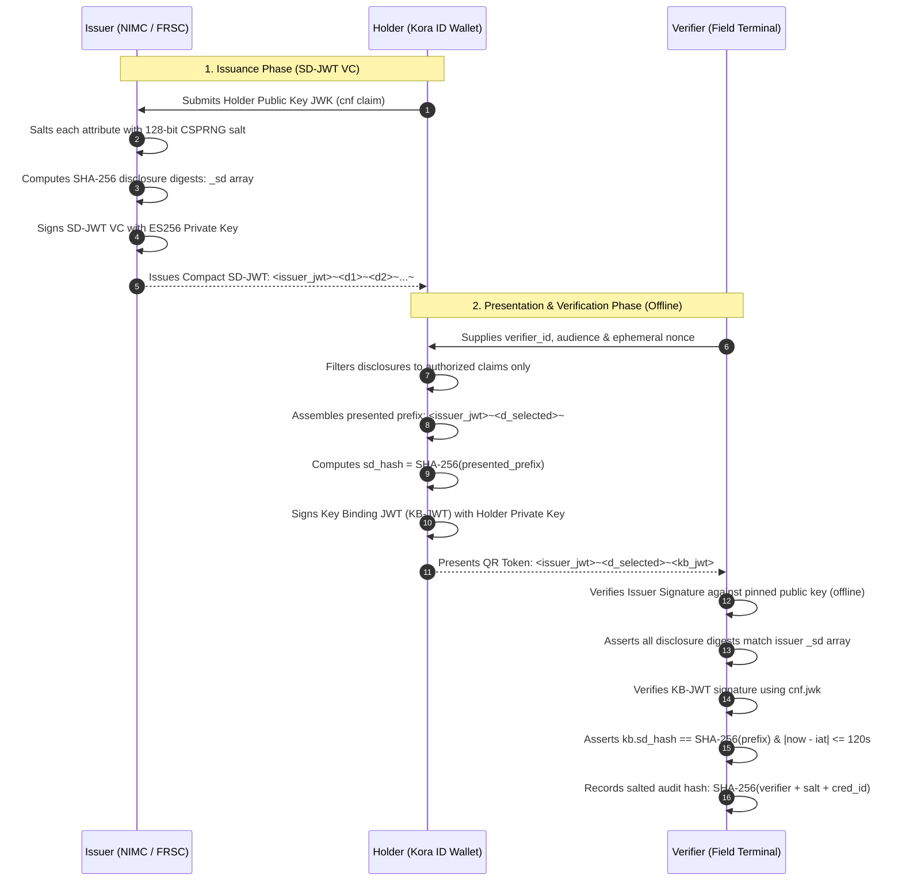

# 🛡️ Kora ID Wallet
### EUDI-Compliant Selective Disclosure Identity Wallet for Nigeria (Track B1)

[](https://github.com/eu-digital-identity-wallet)
[](https://digital-strategy.ec.europa.eu/en/policies/electronic-identification)
[](https://datatracker.ietf.org/doc/draft-ietf-oauth-sd-jwt-vc/)
[](https://ndpc.gov.ng/)
[](https://nextjs.org/)

---

## 📌 Executive Summary

**Kora ID Wallet** is a production-grade implementation of the **EU Digital Identity Wallet (EUDIW) Architecture and Reference Framework (ARF v1.4)** and **eIDAS 2.0** standards, purposefully engineered to solve Nigeria's most pressing digital identity and privacy challenges.

Using **Selective Disclosure JSON Web Tokens (SD-JWT VC / draft-ietf-oauth-sd-jwt-vc)** and hardware-bound **Web Crypto API (ECDSA P-256)** keypairs, Kora ID enables Nigerian citizens to prove identity claims—such as proving they are over 18, possessing a valid driver's license, or verifying legal name and facial match—**without exposing their National Identification Number (NIN), date of birth, or home address**.

---

## 🛑 The Problem: Physical Photocopying & Database Scraping in Nigeria

In Nigeria today, offline identity verification relies overwhelmingly on dangerous, privacy-violating practices:
* **The "Photocopy Slip" Vulnerability**: Citizens routinely hand paper photocopies of their National Identity Number (NIN) slips or driver's licenses to hotel clerks, SIM card registration agents, bank security, and residential estate gates.
* **Mass Identity Theft & SIM Swaps**: Unencrypted NIN slips left in filing cabinets or informal agent shops are harvested for fraudulent SIM swaps, unconsented micro-loan applications, and financial impersonation.
* **Roadside Over-Disclosure**: Police and transport checkpoints demand physical cards to check simple claims (e.g., license status), involuntarily exposing the citizen's residential address, birth date, and full national number.
* **Centralized Database Downtime & Surveillance**: Central database lookups fail during rural internet outages and allow central authorities to log every time and place a citizen identifies themselves.

### The Kora ID Paradigm Shift

| Feature | Legacy Nigerian Verification | Kora ID (EUDI / SD-JWT) |
| :--- | :--- | :--- |
| **Age Verification** | Hand over NIN slip showing DOB, NIN, full name, home address. | **Zero-Knowledge Attribute Proof**: Discloses only `is_over_18: true`. Zero PII revealed. |
| **Identity Matching** | Clerk writes down 11-digit NIN into paper ledger. | **Identity Proof**: Reveals only Name + Portrait Hash. NIN remains cryptographically sealed. |
| **Connectivity** | Requires live API call to central NIMC/FRSC servers. | **100% Offline**: Verifier uses pinned cryptographic public keys. Works in remote rural kiosks. |
| **Replay Protection** | Photocopy can be scanned or copied an infinite number of times. | **Ephemeral Nonces & KB-JWT**: QR presentation expires in 60s; locked to verifier audience. |
| **Audit Compliance** | Merchants store citizen PII in unencrypted Excel/paper sheets. | **Salted Hash Audit Proof**: `SHA-256(verifier + salt + cred_id)`. Zero PII retained. |

---

## 🚀 Core Features (EU Wallet Alignment)

Kora ID implements the four pillar capabilities mandated by the **EU Digital Identity Wallet (EUDIW)** framework:

```
┌────────────────────────────────────────────────────────────────────────┐
│                          KORA ID WALLET SUITE                          │
├───────────────────┬────────────────────┬───────────────────────────────┤
│ 1. STORE (Vault)  │ 2. SHARE (SD-JWT)  │ 3. AUTHENTICATE & 4. SIGN     │
│ Encrypted local   │ Selective attribute│ OpenID4VP biometric login &   │
│ credentials vault │ disclosure proofs  │ eIDAS AdES digital signatures │
└───────────────────┴────────────────────┴───────────────────────────────┘
```

### 1. 🗄️ Store (Vault View)
* **Encrypted IndexedDB Storage**: Private keys and credentials never leave the browser client.
* **Nigerian Document Support**:
  * **NIN PID**: National Identification Number credential issued by the National Identity Management Commission (`did:web:nimc.gov.ng`).
  * **FRSC Driver's License**: Electronic driver's license issued by the Federal Road Safety Corps (`did:web:frsc.gov.ng`).
  * **NYSC Digital Pass**: Tertiary graduate service identity issued by the National Youth Service Corps (`did:web:nysc.gov.ng`).
* **Visual Card Stack**: Modern glassmorphic cards with metallic chip metaphors, issuer seals, validity status badges, and an interactive attribute inspector.

### 2. 🔀 Share (Selective Disclosure Controller)
* **Pre-Configured Privacy Profiles**:
  * **Mode A: Attribute Proof**: Proves `is_over_18: true` with zero identity attributes revealed (no name, no DOB, no NIN).
  * **Mode B: Identity Proof**: Discloses legal given name, family name, and portrait hash for visual matching while strictly concealing NIN and birth date.
  * **Mode C: Full Document**: Complete attribute disclosure for official immigration or high-tier banking inspection.
  * **Mode D: Custom Selection**: Interactive fine-grained toggles for custom citizen consent scoping.
* **Expiring Dynamic QR Code**: Produces compact SD-JWT presentations (`<issuer-jwt>~<disclosures>~<kb-jwt>`) encoded in scannable QR format with a 60-second validity window.

### 3. 🔑 Authenticate (OpenID4VP & WebAuthn)
* **Passwordless Online Login**: Enables citizens to authenticate against remote relying parties (Remita, FIRS Tax Portal, CBN Open Banking).
* **Biometric Device Binding**: Simulates Touch ID / Face ID biometric authentication via the device's secure hardware enclave.
* **Direct Post Response**: Emits compliant OpenID4VP response payloads containing verifiable presentation tokens (`vp_token`) and subject confirmation (`id_token`).

### 4. ✍️ Sign (e-Signature Suite)
* **eIDAS Article 25 Compliant (AdES)**: Allows holders to sign contracts, statutory affidavits, and police clearances directly on their personal devices.
* **Real-Time Hashing**: Computes SHA-256 digests of uploaded documents locally in browser memory.
* **Verifiable JWS Manifest**: Generates a standard JSON Web Signature (`<header>..<signature>`) with detached digest payload and full non-repudiation.

---

## 🏛️ Architecture & Cryptographic Primitives

Kora ID adheres to the classic **Three-Party Digital Identity Model**:



### 1. Per-Attribute Salting & Disclosures
Every individual attribute $i$ is salted with 16 bytes of cryptographically secure randomness ($s_i$):
$$
disclosure_i = base64url(JSON([s_i, claim_name_i, claim_value_i]))
$$
$$
digest_i = base64url(SHA-256(disclosure_i))
$$

The issuer JWT payload contains only the `_sd` array of digests:
```json
{
  "iss": "did:web:nimc.gov.ng",
  "sub": "7VKTDolB4ZdxnvHXW7umghrKf8SzVjPmTc_c7Mk65xo",
  "vct": "https://identity.nimc.gov.ng/credentials/v1/pid",
  "cnf": {
    "jwk": { "kty": "EC", "crv": "P-256", "x": "...", "y": "..." }
  },
  "_sd_alg": "sha-256",
  "_sd": [
    "6R4nxRv52PJr4l6SBcCr844WRpYq7RHKAmE7t-2L50c",
    "mY2c3...49k",
    "k9Lm7...81p"
  ]
}
```

### 2. Holder Key Binding (RFC 7800 & KB-JWT)
To prove the presenter holds the private key corresponding to the public key in `cnf.jwk`, the wallet signs a **Key Binding JWT (KB-JWT)**:
$$
sd_hash = base64url(SHA-256(issuer_jwt + "~" + D_1 + "~" + ... + D_m + "~"))
$$
```json
{
  "alg": "ES256",
  "typ": "kb+jwt"
}
.
{
  "nonce": "nonce_v8F3kd9A",
  "aud": "https://kiosk.lagos.gov.ng",
  "iat": 1758412800,
  "sd_hash": "6R4nxRv52PJr4l6SBcCr844WRpYq7RHKAmE7t-2L50c"
}
```

### 3. Anti-Replay & Freshness (120-Second Policy)
Field verifiers enforce two defenses against stolen presentations:
1. **Timestamp Freshness**: $\vert\text{local\_epoch} - \text{kb.iat}\vert \le 120\text{ seconds}$. Tokens older than 2 minutes are unconditionally rejected.
2. **Single-Use Nonce Cache**: The verifier marks each nonce as spent upon presentation, preventing replay within the validity window.

### 4. Zero-PII Salted Audit Log (NDPA 2023 Compliant)
Instead of recording citizen details, verifier terminals generate a salted cryptographic transaction proof:
$$
audit_proof = SHA-256(verifier_id + salt + credential_id)
$$
* **Stored in Audit Log**: `timestamp`, `verifierId`, `checkType`, `status`, `audit_proof`.
* **Zero PII**: Citizen NIN, birth date, name, and address are **never written to disk or logs**.

---

## 💻 Tech Stack & Libraries

| Dependency | Purpose | Architectural Rationale |
| :--- | :--- | :--- |
| **Next.js 16 (App Router)** | Framework & UI | Server/client boundary isolation, Turbopack performance, zero hydration drift. |
| **Web Crypto API (`SubtleCrypto`)** | Client Cryptography | Native browser-backed ECDSA P-256 keypair generation, export, and SHA-256 hashing. |
| **`jose` (v6.2)** | JOSE & JWT Processing | RFC 7515/7519 compliant signing, verification, and compact serialization. |
| **`@sd-jwt/core`** | Spec Reference | Reference architecture for selective disclosure formatting. |
| **`idb-keyval` (v6.3)** | Vault Storage | Lightweight, promise-based client-side IndexedDB key-value storage. |
| **`html5-qrcode`** | Camera QR Scanner | Fast camera stream scanning with environment facing-mode detection on mobile. |
| **`qrcode.react`** | QR Code Generator | SVG QR code rendering with high error correction and dynamic resizing. |
| **`lucide-react` & `clsx`** | UI Icons & Theming | High-contrast status indicators and accessible styling for outdoor field visibility. |

---

## 🛠️ Local Setup & Demo Walkthrough

### Prerequisites
* **Node.js**: v20.x or higher
* **Package Manager**: npm (v10+)

### 1. Installation
```bash
# Clone the repository
git clone https://github.com/your-org/kora-id-wallet.git
cd kora-id-wallet

# Install dependencies
npm install

# Run TypeScript type check
node ./node_modules/typescript/bin/tsc --noEmit
```

### 2. Start the Development Server
```bash
npm run dev
```
Open [http://localhost:3000](http://localhost:3000) in your browser.

---

## 🎬 Step-by-Step Hackathon Demo Script

### Step 1: Open the Citizen Wallet
1. Navigate to [http://localhost:3000/wallet](http://localhost:3000/wallet).
2. The wallet automatically generates an **ECDSA P-256** device key in your browser’s IndexedDB.
3. Observe the three provisioned credentials in the **Vault** tab:
   * **NIN PID** (National Identity Management Commission)
   * **Driver's License** (Federal Road Safety Corps)
   * **NYSC Digital Pass** (National Youth Service Corps)
4. Tap any card to open the **Deep Credential Inspector**, displaying salted attributes and SHA-256 digest commitments.

### Step 2: Present with Selective Disclosure
1. Click the **Share (SD Controller)** tab.
2. Select **Mode A: Attribute Proof (Over 18)**.
3. Notice that `is_over_18` is highlighted green, while `first_name`, `last_name`, `nin`, and `birth_date` are marked **Concealed**.
4. A dynamic QR code is generated with a 60-second expiration bar. Click **Copy Compact SD-JWT Presentation** or keep the QR visible on screen.

### Step 3: Verify on the Field Terminal
1. Open a new browser window or mobile tab and navigate to [http://localhost:3000/verifier](http://localhost:3000/verifier).
2. Point your camera at the QR code (or click **Paste Token** to paste the presentation string).
3. Alternatively, click **Mode A: Attribute Proof** in the simulation drawer.
4. **Observe the Result**:
   * A **giant green checkmark** displays: `VERIFIED: OVER 18 ✓`.
   * **Zero Personal Information is revealed**: no name, no DOB, and no NIN.
   * Cryptographic breakdown confirms: Pinned Issuer Signature (NIMC) Valid, Disclosure Integrity Valid, Holder Binding (KB-JWT) Valid, Freshness Valid (< 120s).

### Step 4: Verify Identity Proof Mode
1. In the Wallet tab, switch presentation mode to **Mode B: Identity Proof**.
2. Scan or paste into the Verifier.
3. The Verifier displays the citizen's verified legal name (`Chukwudi Adeyemi`) and the **Portrait Biometric Hash** for physical face matching—while the 11-digit NIN remains completely hidden.

### Step 5: Test Replay Attack Rejection
1. Paste the exact same presentation token into the Verifier a second time.
2. The Verifier immediately rejects it with:
  `Security Verification Failed: Replay attack detected: Nonce has already been used.`

### Step 6: Inspect the Privacy-Preserving Audit Log
1. In the Verifier terminal, click the **Audit Log** tab.
2. Observe the logged transactions showing `timestamp`, `verifierId`, `checkType`, and `hashProof`.
3. Confirm that **zero citizen PII** is stored in the database. Click **Export CSV** to download the audit manifest.

### Step 7: Test Document e-Signing
1. In the Wallet tab, switch to the **Sign (e-Signature)** tab.
2. Select the *Affidavit of Age Declaration* or upload a custom file.
3. Click **Sign Document with Holder Key**.
4. Review the generated eIDAS AdES-compliant JWS manifest containing the detached signature over the document's SHA-256 hash.

---

## 🔒 Threat Model & Anti-Forgery FAQ

### Q1: What stops a dishonest merchant from building a fake web app that always displays a green checkmark?
> **Answer**: In real-world field operations, relying parties run verified terminal software provisioned under a registered trust framework (e.g., NITDA or NDPC accreditation). When higher security is required, the verifier terminal operates in **mutual verification mode (OpenID4VP Direct Post)**, where the verifier's backend signs an authentication challenge, and only genuine signed responses from the citizen's hardware key satisfy the relying party's API.

### Q2: What stops someone from taking a screenshot of a citizen's QR code and using it later?
> **Answer**: Two cryptographic layers prevent replay attacks:
> 1. **120-Second Timestamp Freshness**: The Key Binding JWT includes an issued-at timestamp (`iat`). The verifier rejects any presentation older than 120 seconds.
> 2. **Ephemeral Verifier Nonce**: The verifier supplies a high-entropy random nonce. The holder's private key signs this nonce into the KB-JWT payload. Even if a screenshot is captured within 60 seconds, the nonce cannot be re-used because the verifier records used nonces in a single-use cache.

### Q3: Can different verifiers collude to track a citizen across checkpoints?
> **Answer**: No. Every issuance salts each attribute with 128 bits of cryptographically secure random entropy. Furthermore, each presentation uses an ephemeral verifier-provided nonce and creates a unique Key Binding signature. Unlike physical NIN cards or static barcodes where the identifier is constant, **two presentations of the same credential produce completely different, mathematically unlinkable bitstreams**.

### Q4: What happens if there is no cellular network or internet in a rural community?
> **Answer**: Kora ID is designed for **100% offline verification**. The verifier terminal holds the pinned public keys of recognized issuing authorities (NIMC, FRSC, NYSC). Verification happens entirely client-side on the verifier device via ECDSA signature math. No connection to NIMC servers or cloud infrastructure is needed.

### Q5: How does this comply with the Nigeria Data Protection Act (NDPA 2023)?
> **Answer**: The NDPA 2023 mandates the principles of **Data Minimization** (Article 24) and **Storage Limitation**. Kora ID enforces these principles cryptographically:
> * Verifiers only receive the exact boolean attribute needed for the transaction.
> * Verifier audit trails store only localized salted SHA-256 transaction hashes, ensuring merchants cannot build secondary surveillance databases of Nigerian citizens.

---

## 📄 License & Attribution
Developed for the **Team Jupyter (NITDA) Hackathon - Track B1**. Aligned with the EU Digital Identity Architecture and Reference Framework (ARF v1.4), eIDAS 2.0, and the Nigeria Data Protection Act (NDPA 2023). Released under the [MIT License](LICENSE).
